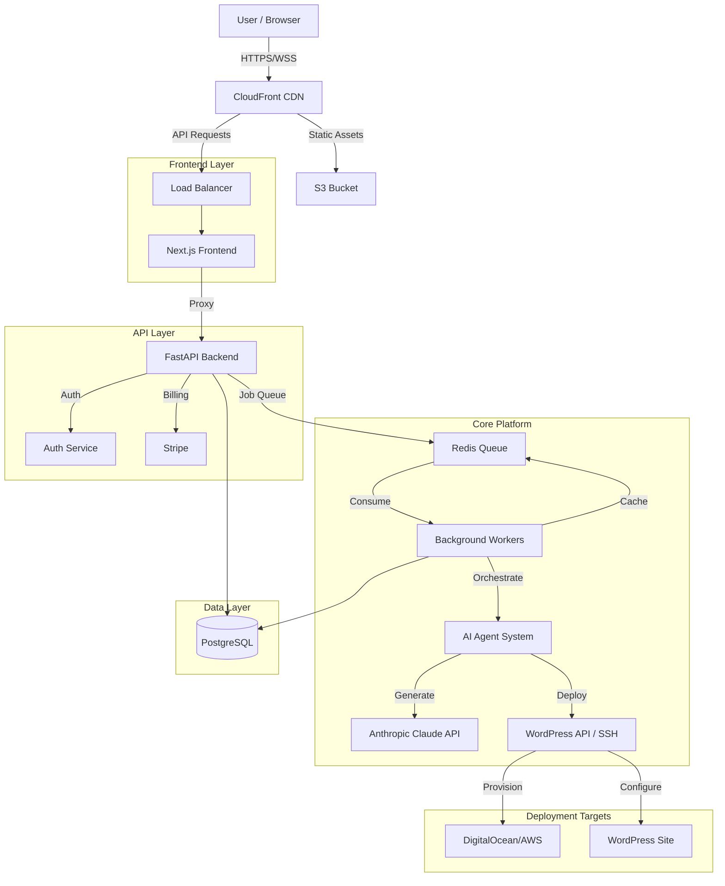

# 🏗️ gsWstudio.ai - System Architecture

## 1. High-Level Architecture Diagram

## 2. Technology Stack

| Component | Technology | Justification |
|-----------|------------|---------------|
| **Frontend** | Next.js 14, React 18, TailwindCSS | SEO-friendly, server-side rendering, rapid UI development with Tailwind. |
| **Backend API** | Python FastAPI | High performance (async), auto-generated docs (OpenAPI), excellent ecosystem for AI/Data. |
| **Database** | PostgreSQL | Robust relational data model for users, sites, and subscriptions. JSONB support for flexible site metadata. |
| **Queue/Cache** | Redis | Fast in-memory caching and reliable job queue for handling long-running site generation tasks. |
| **AI Engine** | Anthropic Claude 3.5 Sonnet | Superior reasoning and coding capabilities for generating high-quality WordPress content and code. |
| **Deployment** | Docker & Kubernetes | Containerization for consistency; K8s for scaling workers independently of the API. |
| **Infrastructure** | AWS / DigitalOcean | Reliable cloud providers with managed database and object storage services. |

## 3. Component Breakdown

### A. Frontend (Next.js)
- **Wizard UI**: Multi-step form for collecting business requirements.
- **Dashboard**: User site management, status tracking, and billing.
- **Editor**: Visual preview and simple edits before deployment.
- **Real-time Client**: WebSocket client for receiving progress updates.

### B. API Gateway (FastAPI)
- **Auth Service**: JWT-based authentication and role management.
- **Job Manager**: Accepts generation requests and pushes to Redis queue.
- **Status Monitor**: Exposes endpoints to poll job status.
- **Billing**: Handles Stripe webhooks and subscription logic.

### C. AI Agent System (Python Workers)
- **Planning Agent**: Analyzes business info to create site structure (sitemap).
- **Content Agent**: Generates SEO-optimized copy for pages and posts.
- **Design Agent**: Selects themes, fonts, and color palettes.
- **Plugin Agent**: Recommends and configures necessary plugins.
- **Orchestrator**: Manages the flow and data passing between agents.

### D. Deployment Engine
- **WP-CLI Wrapper**: Executes WordPress commands via SSH.
- **Provisioner**: Uses Terraform/API to spin up new VPS instances.
- **DNS Manager**: Configures domain records (Cloudflare API).

## 4. Data Flow

1.  **Request**: User submits business info via Next.js Wizard.
2.  **Queue**: API creates a `Job` record (status: `queued`) and pushes ID to Redis.
3.  **Process**: Worker pops Job ID. Orchestrator initializes AI Agents.
4.  **Plan**: Planning Agent calls Claude API → returns Sitemap JSON.
5.  **Generate**: Content Agent iterates through Sitemap → generates HTML/Markdown.
6.  **Deploy**: Deployment Engine provisions WP, installs Theme/Plugins, uploads Content.
7.  **Notify**: Worker updates Job status to `completed` and notifies Frontend via WebSocket.

## 5. API Endpoint Specifications

### Authentication
- `POST /api/v1/auth/login`: Return JWT access/refresh tokens.
- `POST /api/v1/auth/register`: Create new user account.

### Sites
- `POST /api/v1/sites/generate`: Start site generation job.
  - Input: `{ business_name, type, description, goals }`
  - Output: `{ job_id, status: "queued" }`
- `GET /api/v1/jobs/{job_id}`: Get real-time status and progress.
- `GET /api/v1/sites`: List all user sites.

### Infrastructure
- `POST /api/v1/hosting/provision`: Request new server provision.
- `POST /api/v1/wordpress/validate`: Check WP credentials.

## 6. Database Schema Overview

### `users`
- `id` (UUID), `email`, `password_hash`, `subscription_tier`, `created_at`

### `sites`
- `id` (UUID), `user_id`, `name`, `domain`, `wp_admin_url`, `status` (draft, generating, active), `metadata` (JSONB)

### `jobs`
- `id` (UUID), `site_id`, `type` (generation, deployment), `status`, `progress` (0-100), `logs` (Text)

### `subscriptions`
- `id`, `user_id`, `stripe_customer_id`, `plan_id`, `status`, `current_period_end`

## 7. Deployment Architecture

- **Production**:
  - **Kubernetes Cluster**:
    - `api-deployment`: Scalable FastAPI pods (HPA enabled).
    - `worker-deployment`: Scalable Python worker pods (KEDA scaling based on Redis queue depth).
    - `frontend-deployment`: Next.js pods.
  - **Managed Services**: AWS RDS (Postgres), ElastiCache (Redis).

- **Local Dev**:
  - `docker-compose` spinning up: FastAPI, Next.js, Postgres, Redis.

## 8. Scalability Considerations

- **Horizontal Scaling**: The API and Workers are stateless. We can spin up 100+ workers to handle 1000+ concurrent requests.
- **Queue-Based Load Leveling**: Redis acts as a buffer. If 5000 requests come in, they queue up; the system processes them at max worker capacity without crashing.
- **Database Read Replicas**: For high read traffic (dashboard views), use read replicas.
- **CDN**: Serve all static assets (images, JS, CSS) via CloudFront to offload the frontend server.

## 9. Security Architecture

- **Encryption**:
  - **In-transit**: TLS 1.3 everywhere (HTTPS).
  - **At-rest**: Database and S3 buckets encrypted with AES-256.
- **Secrets Management**: Do not store keys in code. Use AWS Secrets Manager or Vault.
- **Isolation**: Each generated WordPress site runs on its own isolated environment (container or VPS) to prevent cross-site contamination.
- **Input Validation**: Pydantic models strictly validate all incoming API data.

## 10. Cost Optimization

- **Spot Instances**: Use AWS Spot Instances for Worker nodes (fault-tolerant) to save up to 90% on compute.
- **Token Management**: Cache AI responses for similar prompts. Use smaller models (Claude Haiku) for simple tasks and larger models (Sonnet/Opus) only for complex creative writing.
- **Storage Lifecycle**: Move old build logs and artifacts to S3 Glacier Deep Archive.
- **Serverless**: Consider AWS Lambda for the API layer if traffic is bursty.

---
*Generated by gsWstudio.ai Architecture Planner*
